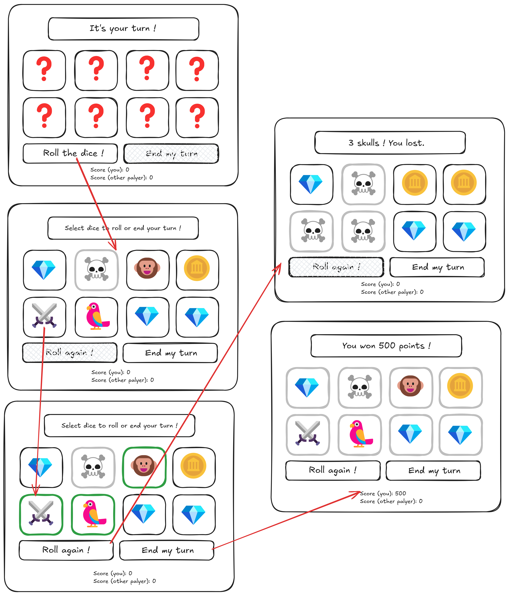

# Mille Sabords !

Mille Sabords is a multiplayer web game application written in Scala. The rules and the operation of the game are explained below.


---
## Online demo
You can give it a try by following this link : https://cs214-apps.epfl.ch/app/app142 .

---
## Installation
### Requirements 
- Scala 3 : Follow the “Install Scala on your computer” section of the instructions on the Scala website (https://docs.scala-lang.org/getting-started/index.html) At some point, the Coursier setup program will ask: “No JVM found, should we try to install one? [Y/n]”. Respond “y” (for “yes”) and press Enter / ⏎. Similarly, when it asks about updating the PATH environment variable, respond “y”.

## Launching
Open your terminal and enter
```
sbt --client
```
If nothing appears when you type commands into SBT, try
```
sbt -Djline.terminal=none --client
```
---
## Game operation


---
### Rules of the game 
The game is highly inspired by the pirate theme dice game “Mille Sabord” (in french) or “1000 Bomben and Grenade” (in english). We will explain below the rules of our simplified version of the game.
The game contains 8 6-face-dice with different symbols on each of their faces (so 6 different symbols). The symbols are coins, diamonds, swords, parrots, monkeys and skulls. The players must play one after the other, until one of them reaches a total cumulative score of 3000 points. Scores can be obtained during each player round by maximizing the number of similar symbols while avoiding skulls.


During a player round, the player throws the dice and observes what she gets. If she gets less than 2 times the same symbols, she actually has no points. If she gets 3 times the same symbole (except the skull), this counts for 100 points. If she gets more than 3 times the same symbole, she scores more points according to the scoring sheet. The coins and diamonds have an additional effect as they count for 100 points on their own no matter their amount. Meaning that if a player gets 3 diamonds, she gets 100 points for each individual diamond, meaning 300 points and 100 additional points because the player has 3 times the same symbole. However whenever a player gets 3 skulls, her round abruptly ends and she loses all the points she accumulated during this round, and only this round.
After the first throw, if the player can still play (gets less than 3 skulls), she can choose any number of dice she wants to rethrow, in hope to get a higher number of similar symbols. Dice with skulls are the only ones which can’t be rethrown. As long as a player has less than 3 skulls, she can choose whenever she wants to end her turn, saving her score for the rest of the game. This means that we will only count the score marked for the round where the player stopped before getting 3 skulls. When a player stops her round or gets 3 skulls, the next player can start her round by throwing the 8 dice.

Other additional rules are also available and could possibly be implemented if we have enough time.


---
### User stories
- As a player, I want to enter my name and friend’s name, so that I can play with them online to Mille Sabords.
- As a user I want to be able to rethrow each dice that aren’t skulls by clicking on them, so that I can try to score more points.
- As a player on a multiplayer game, I want to see the actions of the active player when it’s not my turn, so that I know how are playing my opponents.
- As a player ending my turn, I want to see my score being updated depending on the points I score (if any) during my turn, so that I can keep track of my score.
---
### Game Requirements

- The dice must be initially displayed as a row of empty squares
- The dice after being thrown should be displayed as an array of 8 squares with randomly chosen symbols.
- Throughout the game, a counter should display each player’s score.
- The rules of the game must be displayed somewhere on the screen
- Clicking on the dice should select them and mark them as ready to be rethrown
    - Visually, create a green square around it signaling it has been selected
- Clicking on the “Throw” button after having selected dice should change their symbols by other randomly chosen symbols. The non-selected dice will not change, and the selected dice (green squares) will be cleared (no green marker anymore)
- Possible results include any of the 6 possible emojis on the dice, placed within the square
- The Skull emoji should result in a red square around the dice, signaling it cannot be selected to be rethrown and thus can’t change for the round.
- 3 Skull emojis trigger the end of the round, and a score of 0 for th round
- Clicking on the “Done” button signals the end of the current player’s turn. The dice are reinitialized for the next player’s turn.
- The “Throw” and “Done” button will be green/red and clickable only for one player at a time. When one player is waiting for the other to play, their “Play” and “Done” buttons will be gray, signaling that it is not their turn to play.
- The displayed dice will be the dice of the current player’s turn, allowing both players to follow the game even if it isn’t their turn
- If a player reaches a score of 3000, the game ends for both players, and their scores are displayed.

---
### Roles

Selma will work on the user interface and adapt the lab Rock-Paper-Scissors to our game.
Flavia will work on the logic of the game and state machine implementation (Logic.scala file).
Océane will work on the types of the game (Types.scala file) and the tests. She will also help with the logic of the game.
Roméo will work on the serialization and deserialization process (Wire.scala).
---
### Mock-ups



---
## Team members

```
 - Benhassine Selma - 300148, selma.benhassine@epfl.ch
 - Maignal Roméo Lucien Emile Jeremy - 360568, romeo.maignal@epfl.ch
 - Voland Océane - 325144, oceane.voland@epfl.ch
 - Wallenhorst Flavia - 264996, flavia.wallenhorst@epfl.ch
```

